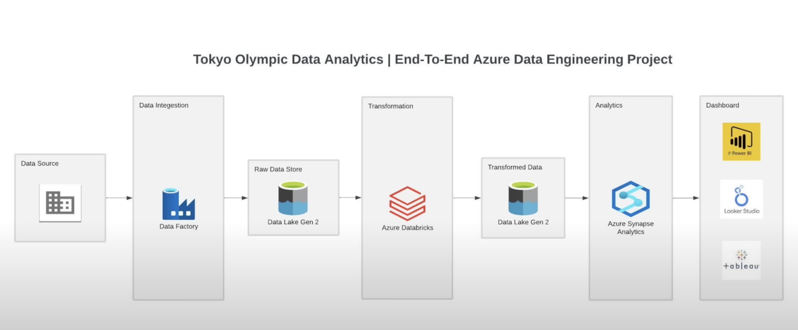
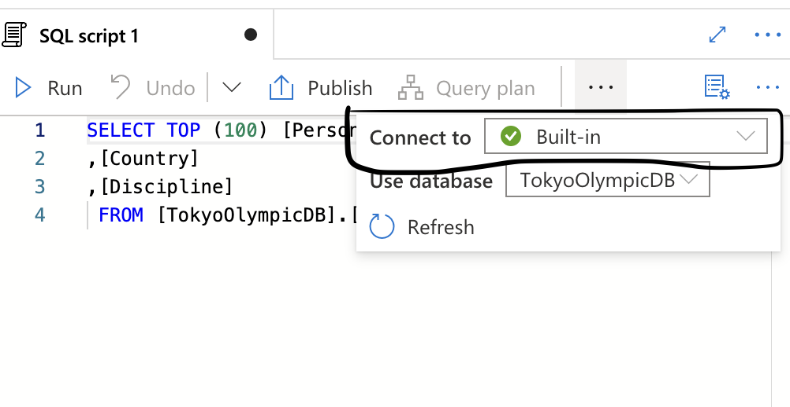

# Introduction

- **Data Engineer Role**: My objective is to curate the most accurate datasets for advanced analytics.
- **Data Scientist Role**: I apply statistical methods to deeply analyze data, providing valuable predictions to inform decisions.

## Overview
This project amalgamates both Data Engineering and Data Scientist skill sets. I employed a framework based on Azure for ETL processes. Post the data cleaning and transformation, the data is passed to R for further advanced analysis.

## Tools Used:
- Azure Data Factory: For Data Integration
- Data Lake Gen 2: Storage for Raw & Transformed Data
- Azure Databricks: Data Transformations
- Azure Synapse Analytics: Advanced Analytics
- R Studio: Advanced Data Science Analysis

## Framework:

## Instructions:

### Step 1: Data Set Up
- Download the dataset from [Kaggle](https://www.kaggle.com/datasets/arjunprasadsarkhel/2021-olympics-in-tokyo/code).
- Store the data on this [Github Repository](https://github.com/tpham45/Data-Engineer-Project.git).

### Step 2: Extract Data into Azure Cloud
- Use Data Factory to integrate raw data from the [data source](https://github.com/tpham45/Data-Engineer-Project/tree/Data-Source).
- Download the raw data and import it into Data Lake Gen 2.

### Step 3: Data Transformation using Azure Databricks
- Set up an environment to bridge Azure Data Lake Gen 2 with Azure Databricks.
- Review the codebase [here](https://github.com/tpham45/Data-Engineer-Project/blob/develop/Code/Transformation.py).
- **Note**: Ensure the "final data" is loaded back into the Azure Data Lake Gen 2 under the `transformed-data` folder.

> You have the flexibility to load data into any preferred environment, be it Azure Synapse Analytics, R Studio, or others.

### Step 4a: Load Data by Connecting Azure Data Lake Gen 2 & R Studio
1. Establish Token and Endpoint Token.
2. Connect to the 'tokyodatasources' container within the Azure Blob storage endpoint.
3. Load the data into R Studio and proceed with analysis.
4. Review the codebase [here](https://github.com/tpham45/Data-Engineer-Project/blob/develop/Code/DataImport.R).

### Step 4b: Load Data by Connecting Azure Data Lake Gen 2 & Azure Synapse Analytics
> Note: I haven't primarily utilized Azure Data Synapse for this project. However, I'll provide a brief guide based on my knowledge.

1. **Why use a Serverless SQL Pool?** 
   
   - **Pay-per-Query**: Costs are based only on actual usage.
   - **Direct Data Analysis**: Directly query large datasets.
   - **Versatile Data Format Support**: Handles Parquet, CSV, JSON, etc.
   - **Familiarity**: Employs T-SQL for querying.
   - **Integrated with Azure Synapse Studio**: Aids in data exploration and visualization.
   - **Security**: Incorporates Azure Active Directory authentication.
   - **Use Case**: Best suited for ad-hoc data exploration and analytics.

2. Construct a Lake Database, given that the dataset resides on Azure Data Lake Gen 2.
3. Create an external table from the Data Lake. You'll need to:
   - Name the external table.
   - Link services to your storage account.
   - Specify the input file or folder.
   - Define the source file format settings. Be attentive to headers.
   - Configure General, Columns & Relationships based on your dataset.
   - Finally, validate and publish your configurations.

## References:
- [Dataset Source](https://www.kaggle.com/datasets/arjunprasadsarkhel/2021-olympics-in-tokyo/code)
- [Instructional Video](https://www.youtube.com/watch?v=IaA9YNlg5hM)
