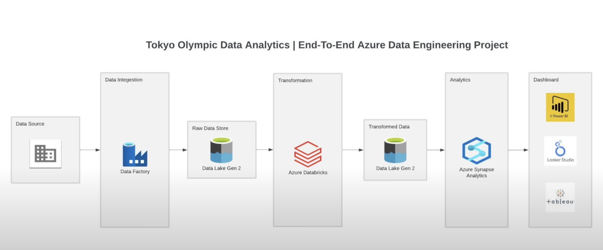

Introduction
* As a Data Engineer. My mission is giving the best dataset for furthure advanced analytics.
* As a Data Scintiest. My mission is applying statistical skill to analyze data in advance and giving best prediction for decision-making.

Preview: This project is a combination between DE and DS workskill. I have applied framework bases on Azure for ETL methodology. Then using the dataset after cleaning and transforming, I have turned them into R for DS analyzing futhure.

Tool:
* Azure Data Factory - Data Intergation 
* Data Lake Gen 2 - Raw & Transformed Data Store
* Azure Databricks - Data Transformations
* Azure Synapse Analytics - Advanced Analytics
* R Studio - DS Advanced Analytics

Framework:
""

Instruction:
* Step 1: Data Set Up
    - Download Dataset from Kaggle.
    - Store data on Github Repos: 'https://github.com/tpham45/Data-Engineer-Project.git'.

* Step 2: Data Extract
    - Data Factory - Intergate data from data source (Github)

References:
* Dataset: 'https://www.kaggle.com/datasets/arjunprasadsarkhel/2021-olympics-in-tokyo/code'
* Instruction Video: 'https://www.youtube.com/watch?v=IaA9YNlg5hM' 

