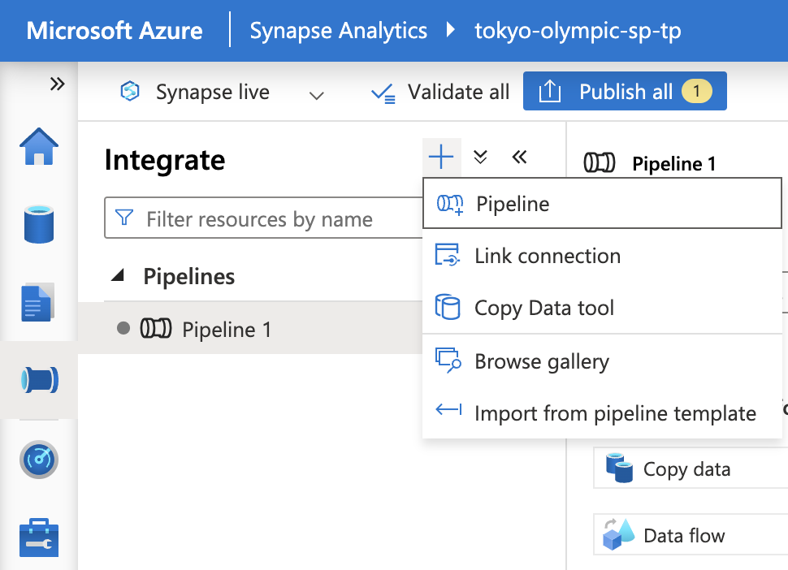

Introduction
* As a Data Engineer. My mission is giving the best dataset for furthure advanced analytics.
* As a Data Scintiest. My mission is applying statistical skill to analyze data in advance and giving best prediction for decision-making.

Preview: This project is a combination between DE and DS workskill. I have applied framework bases on Azure for ETL methodology. Then using the dataset after cleaning and transforming, I have turned them into R for DS analyzing futhure.

Tool:
* Azure Data Factory - Data Intergation 
* Data Lake Gen 2 - Raw & Transformed Data Store
* Azure Databricks - Data Transformations
* Azure Synapse Analytics - Advanced Analytics
* R Studio - DS Advanced Analytics

Framework:

Instruction:
* Step 1: Data Set Up
    - Download Dataset from Kaggle.
    - Store data on Github Repos: 'https://github.com/tpham45/Data-Engineer-Project.git'.

* Step 2: Data Extract into Azure Cloud
    - Data Factory - Intergate raw data from data source (https://github.com/tpham45/Data-Engineer-Project/tree/Data-Source).
    - Download raw data and import in Data Lake Gen 2.

* Step 3: Data Transform by using Azure Databricks
    - Set up environment to connect Azure Data Lake Gen 2 & Azure Databricks
    - Code base for review (https://github.com/tpham45/Data-Engineer-Project/blob/develop/Code/Linkgen.py)
    !!! Remeber - Loading "final data" back to Azure Data Lake Gen 2 on -> transformed-data folder.

/* You can choose to load data into any environment you prefer, be it Azure Synapse Analytics, R Studio, or others. */

* Step 4a: Data Loading by linking Azure Data Lake Gen 2 & R Studio
    - Set Up Token, Endpoint Token.
    - Connect to the 'tokyodatasources' container within the Azure Blob storage endpoint.
    - Loading data into R studion & Analyzing.
    - Code base for review (https://github.com/tpham45/Data-Engineer-Project/blob/develop/DataImport.R)

* Step 4b: Data Loading by linking Azure Data Lake Gen 2 & Azure Sysnapse Analytics
    - Create a data pipeline on Azure Sysnapse Analytics

References:
* Dataset: 'https://www.kaggle.com/datasets/arjunprasadsarkhel/2021-olympics-in-tokyo/code'
* Instruction Video: 'https://www.youtube.com/watch?v=IaA9YNlg5hM' 

